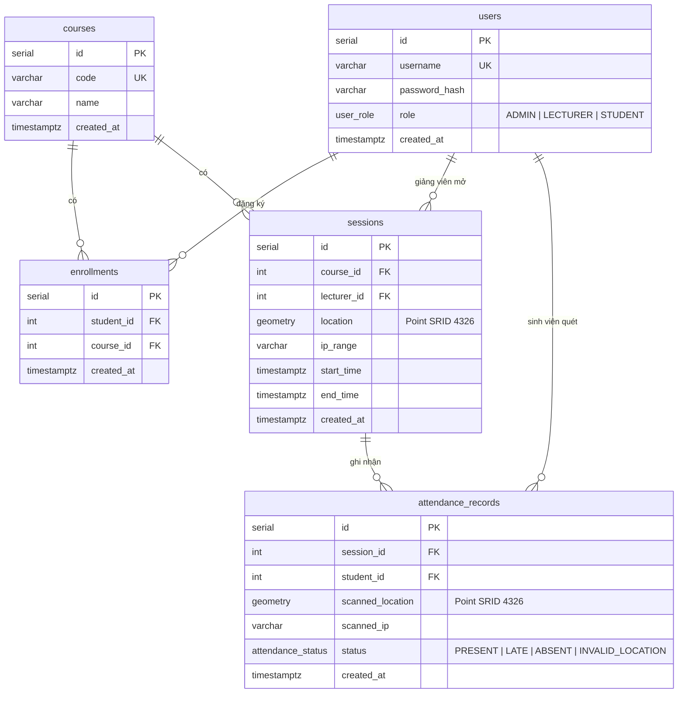

# 📋 T002 — Khởi tạo Database và Migration

| Thuộc tính | Giá trị |
|---|---|
| **Task ID** | T002 |
| **Stream** | Backend / Database |
| **Epic** | Data Foundation |
| **Người phụ trách** | Cường (Backend/DevOps Lead) |
| **Trạng thái** | ✅ Hoàn thành (2026-10-05) |
| **Definition of Done** | App kết nối được PostgreSQL, chạy lệnh migrate tạo đủ 5 bảng với khóa chính/khóa ngoại và kiểu PostGIS cho tọa độ |

---

## 1. Mục tiêu
Tạo cơ sở dữ liệu cho toàn hệ thống và một quy trình **migration** để mọi thành viên chỉ cần chạy 1 lệnh là có database giống hệt nhau (không phải copy-paste SQL thủ công).

## 2. Những gì đã làm

### 2.1. Công cụ Migration: `db-migrate` + `db-migrate-pg`
- Cấu hình: `backend/database.json` — đọc thông tin kết nối từ biến môi trường (`DB_HOST`, `DB_PORT`, `DB_USER`, `DB_PASSWORD`, `DB_NAME`), không hardcode mật khẩu.
- Script trong `package.json`:

| Lệnh | Tác dụng |
|---|---|
| `npm run migrate` | Chạy các migration chưa chạy (tạo bảng) |
| `npm run migrate:down` | Hoàn tác migration gần nhất (xóa bảng) |

- File migration (viết bằng SQL thuần cho dễ đọc):
  - `backend/migrations/20261005163043-initial-schema.js` (file khung do tool sinh ra, không cần sửa)
  - `backend/migrations/sqls/20261005163043-initial-schema-up.sql` ← **tạo bảng**
  - `backend/migrations/sqls/20261005163043-initial-schema-down.sql` ← **xóa bảng**

### 2.2. Kết nối DB cho ứng dụng: `src/config/database.js`
Dùng `Pool` của thư viện `pg` (connection pool — tái sử dụng kết nối, không mở kết nối mới cho mỗi request). Các Model sẽ `require` file này để truy vấn.

### 2.3. Database Schema



### 2.4. Giải thích các quyết định thiết kế
| Quyết định | Lý do |
|---|---|
| `CREATE EXTENSION postgis` | Cho phép lưu và tính khoảng cách tọa độ GPS trực tiếp trong DB (bán kính 50m) |
| `GEOMETRY(Point, 4326)` | SRID 4326 = hệ tọa độ WGS84, chính là hệ mà GPS điện thoại trả về (latitude/longitude) |
| Kiểu `ENUM` cho `role` và `status` | DB tự chặn giá trị sai (vd: không thể lưu role = `"TEACHER"`) |
| `UNIQUE(student_id, course_id)` | Một SV không thể đăng ký 1 lớp 2 lần |
| `UNIQUE(session_id, student_id)` | Một SV chỉ có **1 bản ghi điểm danh** mỗi phiên → chống quét nhiều lần |
| `ON DELETE CASCADE` | Xóa lớp/phiên/user thì dữ liệu liên quan tự xóa theo, không để lại dữ liệu "mồ côi" |
| `TIMESTAMP WITH TIME ZONE` | Tránh lệch giờ giữa server và client |

> **Lưu ý khi làm việc với PostGIS:** khi tạo Point phải truyền **kinh độ trước, vĩ độ sau**: `ST_SetSRID(ST_MakePoint(longitude, latitude), 4326)`. Nhầm thứ tự là lỗi rất phổ biến.

## 3. Cách chạy (cho thành viên mới)
1. Cài **PostgreSQL** + extension **PostGIS** (trên Windows: dùng *Stack Builder* đi kèm bộ cài PostgreSQL để cài PostGIS).
2. Tạo database rỗng tên `smart_classroom` (pgAdmin hoặc DBeaver).
3. Cập nhật `DB_USER`, `DB_PASSWORD` trong `backend/.env`.
4. Chạy:
   ```bash
   cd backend
   npm run migrate
   ```
5. Kết quả thành công: `[INFO] Processed migration 20261005163043-initial-schema` và `[INFO] Done`.

### Xử lý lỗi thường gặp
| Lỗi | Nguyên nhân / Cách sửa |
|---|---|
| `password authentication failed for user "postgres"` | Sai `DB_PASSWORD` trong `.env` |
| `database "smart_classroom" does not exist` | Chưa tạo database ở bước 2 |
| `could not open extension control file ... postgis` | Chưa cài PostGIS |

## 4. Quy tắc khi thay đổi Database về sau
- ❌ **KHÔNG** sửa file migration đã chạy (người khác đã chạy rồi sẽ không nhận được thay đổi).
- ✅ Tạo migration mới: `npx db-migrate create <ten-thay-doi> --sql-file`, viết SQL vào file `-up.sql` và hoàn tác vào file `-down.sql`.

## 5. ⚠️ Lưu ý & Việc còn tồn đọng
- [ ] Bảng `users` chỉ có `username`, chưa có `full_name` / `email` / `student_code`. Nếu Dashboard cần hiển thị tên SV → thêm bằng migration mới.
- [ ] Bảng `courses` chưa có cột giảng viên phụ trách (`lecturer_id`) — cần cân nhắc khi làm module Courses.
- [ ] Chưa tạo **spatial index** (`GIST`) cho cột `location` — chưa cần thiết với dữ liệu nhỏ, có thể bổ sung sau.
