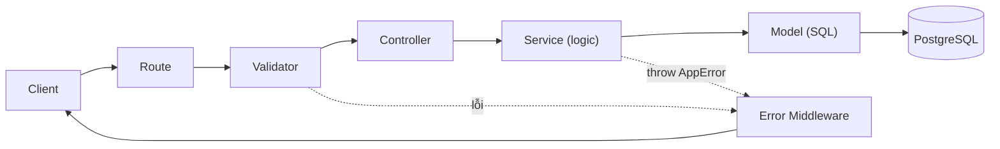

# 📋 T003 — Module Authentication & Authorization

| Thuộc tính | Giá trị |
|---|---|
| **Task ID** | T003 |
| **Stream** | Backend |
| **Epic** | Core Services (API) |
| **Người phụ trách** | Cường (Backend/DevOps Lead) |
| **Trạng thái** | ✅ Hoàn thành (2026-10-06) |
| **Definition of Done** | Có Controller/Service/Route cho Auth; Register mã hóa password vào DB; Login trả Token đúng format chuẩn |

---

## 1. Mục tiêu
Định danh người dùng (Đăng ký / Đăng nhập) bằng **JWT** và cung cấp **middleware phân quyền** để các API sau (tạo phiên điểm danh, quét QR...) biết *ai* đang gọi và *có được phép* hay không.

## 2. Luồng xử lý một request



- **Controller không có `try/catch`**: Express 5 tự chuyển lỗi từ hàm `async` vào `error.middleware.js`.
- **Service ném `AppError(message, statusCode)`** thay vì tự trả response → Service không phụ thuộc Express, dễ viết test.

## 3. Các file đã tạo / sửa

| Tầng | File | Vai trò |
|---|---|---|
| Config | `src/config/jwt.js` | Đọc `JWT_SECRET`, `JWT_EXPIRES_IN`, `BCRYPT_SALT_ROUNDS`. **Thiếu `JWT_SECRET` → server dừng ngay** |
| Model | `src/models/user.model.js` | Câu SQL tham số hóa (`$1, $2`) chống SQL Injection. Không bao giờ trả `password_hash` ra ngoài (trừ hàm dùng cho login) |
| **Service** | `src/services/auth.service.js` | `register`, `login`, `verifyToken`, `getCurrentUser` — bcrypt + JWT |
| Validator | `src/validators/auth.validator.js` | Kiểm tra & chuẩn hóa input (trim, lowercase username, role mặc định) |
| Controller | `src/controllers/auth.controller.js` | Gọi service, trả response |
| Route | `src/routes/auth.routes.js` | Khai báo 3 endpoint |
| Route | `src/routes/index.js` | Router tổng — **module mới đăng ký tại đây** |
| Middleware | `src/middlewares/auth.middleware.js` | `authenticate` và `authorize(...roles)` |
| Middleware | `src/middlewares/error.middleware.js` | `notFound` (404) + `errorHandler` tập trung |
| Utils | `src/utils/AppError.js` | Class lỗi nghiệp vụ có kèm HTTP status |
| Utils | `src/utils/response.js` | `sendSuccess` / `sendError` → format chuẩn `{status, message, data}` |
| Sửa | `src/app.js` | Gắn `/api` router + error handlers |
| Sửa | `.env.example` | Thêm `JWT_EXPIRES_IN`, `BCRYPT_SALT_ROUNDS` |

Dependencies mới: `bcryptjs` (bản JS thuần, không cần build native trên Windows), `jsonwebtoken`.

## 4. API Reference

### `POST /api/auth/register`
```json
// Request body
{ "username": "sv001", "password": "secret123", "role": "STUDENT" }
```
- `username`: 3–50 ký tự, chỉ gồm chữ, số, `_`, `.` (tự chuyển về chữ thường)
- `password`: 6–72 ký tự
- `role`: `STUDENT` (mặc định) hoặc `LECTURER`

```json
// 201 Created
{
  "status": "success",
  "message": "Register successfully",
  "data": {
    "user": { "id": 1, "username": "sv001", "role": "STUDENT", "created_at": "..." },
    "token": "eyJhbGciOiJIUzI1NiIs..."
  }
}
```

### `POST /api/auth/login`
```json
{ "username": "sv001", "password": "secret123" }
```
→ `200 OK`, cùng cấu trúc `data: { user, token }` như trên.

### `GET /api/auth/me` 🔒
Header: `Authorization: Bearer <token>` → `200 OK`, `data: { user }`.

### Bảng mã lỗi
| HTTP | Khi nào | `message` |
|---|---|---|
| 400 | Input không hợp lệ / JSON sai cú pháp | Mô tả lỗi cụ thể |
| 401 | Sai username hoặc password | `Invalid username or password` |
| 401 | Thiếu / sai / hết hạn token | `Authentication token is missing` / `Invalid token` / `Token has expired` |
| 403 | Không đủ quyền | `You do not have permission to perform this action` |
| 404 | Route không tồn tại | `Route not found: ...` |
| 409 | Username đã tồn tại | `Username already exists` |

Mọi lỗi đều có dạng: `{ "status": "error", "message": "...", "data": null }`

## 5. 🧩 Cách dùng middleware cho các module sau (QUAN TRỌNG)
```js
const { authenticate, authorize } = require('../middlewares/auth.middleware');

// Chỉ cần đăng nhập
router.get('/profile', authenticate, controller.profile);

// Chỉ Giảng viên được mở phiên điểm danh
router.post('/sessions', authenticate, authorize('LECTURER'), controller.create);

// Nhiều role
router.get('/reports', authenticate, authorize('ADMIN', 'LECTURER'), controller.report);
```
Sau `authenticate`, controller dùng được `req.user = { id, role }`.

**Dành cho Frontend (Thư, Bảo):** lưu `token` sau khi login và gửi kèm header `Authorization: Bearer <token>` ở mọi request cần đăng nhập. Gặp `401` → chuyển về màn hình login.

## 6. Quyết định bảo mật
| Quyết định | Lý do |
|---|---|
| API công khai **không cho tạo ADMIN** | Chống leo thang đặc quyền. Admin sẽ được tạo bằng script seed |
| Cùng 1 thông báo cho "sai username" và "sai password" | Không để lộ username nào tồn tại |
| Luôn chạy `bcrypt.compare` kể cả khi user không tồn tại (so với `DUMMY_HASH`) | Thời gian phản hồi như nhau → chống *timing attack* dò username |
| Bắt lỗi PostgreSQL `23505` khi insert | Xử lý trường hợp 2 request đăng ký cùng username **đồng thời** (race condition) |
| Password tối đa 72 ký tự | bcrypt bỏ qua phần vượt quá 72 byte |
| JWT payload chỉ chứa `sub` (user id) và `role` | Payload JWT chỉ là Base64, ai cũng đọc được → không chứa dữ liệu nhạy cảm |
| Production ẩn chi tiết lỗi 500 | Không lộ thông tin hệ thống cho kẻ tấn công |

## 7. Kết quả kiểm thử (E2E với DB thật)
| # | Kịch bản | Kết quả |
|---|---|---|
| 1 | Đăng ký hợp lệ | ✅ 201 + token |
| 2 | Đăng ký trùng username | ✅ 409 |
| 3 | Tự đăng ký role ADMIN | ✅ 400 |
| 4 | Login sai password | ✅ 401 |
| 5 | Login user không tồn tại | ✅ 401 (cùng message với #4) |
| 6 | Login đúng | ✅ 200 + token |
| 7 | `/me` có token | ✅ 200 |
| 8 | `/me` không token | ✅ 401 |
| 9 | `/me` token bị sửa | ✅ 401 |
| 10 | Route không tồn tại | ✅ 404 |

## 8. ⚠️ Lưu ý & Việc còn tồn đọng
- [ ] **Đổi `JWT_SECRET` trong `.env`** (đang là giá trị mẫu). Tạo chuỗi ngẫu nhiên:
  `node -e "console.log(require('crypto').randomBytes(48).toString('hex'))"`
- [ ] Có 1 user test (`test_32470`, id=1) trong DB từ lúc kiểm thử → xóa nếu muốn: `DELETE FROM users WHERE username LIKE 'test_%';`
- [ ] Chưa có script seed tài khoản **ADMIN** → dự kiến làm ở T004.
- [ ] Chưa có cơ chế logout / refresh token / thu hồi token (token hợp lệ đến khi hết hạn `1d`).
- [ ] Chưa có rate limiting cho `/login` (chống brute-force) — nên bổ sung trước khi deploy.
- [ ] Chưa có unit test tự động (hiện mới kiểm thử thủ công).
